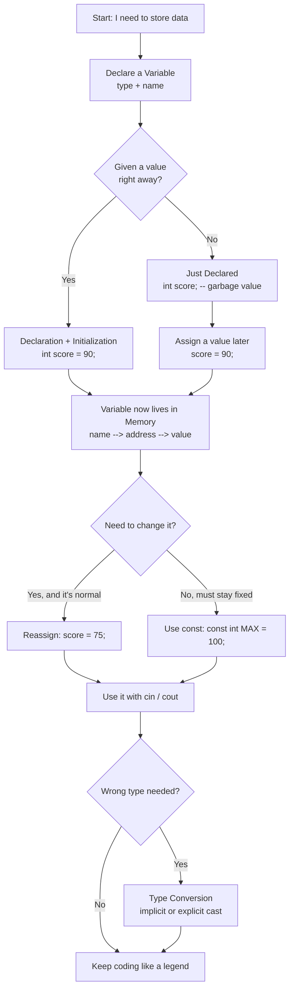

<div align="center">
⋆˚꩜｡
</div>
<div align="center">

</div>

<div align="center">

> *give it a STAR* ♡

</div>

---

## Table of Contents .✦ ݁˖

1. [What is a Variable?](#1-what-is-a-variable)
2. [Why Do We Use Variables?](#2-why-do-we-use-variables)
3. [How Variables Are Stored in Memory](#3-how-variables-are-stored-in-memory--basic-idea)
4. [Variable Declaration](#4-variable-declaration)
5. [Variable Initialization](#5-variable-initialization)
6. [Declaration vs Initialization](#6-declaration-vs-initialization)
7. [Assigning / Reassigning Values](#7-assigning--reassigning-values)
8. [Variable Naming Rules](#8-variable-naming-rules)
9. [Identifiers](#9-identifiers)
10. [Keywords](#10-keywords)
11. [Case Sensitivity](#11-case-sensitivity)
12. [Basic Data Types](#12-basic-data-types)
13. [Declaring Multiple Variables](#13-declaring-multiple-variables)
14. [Constants Using `const`](#14-constants-using-const)
15. [Basic Input/Output with Variables](#15-basic-inputoutput-with-variables)
16. [Basic Type Conversion](#16-basic-type-conversion)
17. [The Whole Vibe, Mapped Out](#the-whole-vibe-mapped-out--)
18. [The Big Colorful Brain Map](#the-big-colorful-brain-map-)
19. [Memory, But Make It Simple](#memory-but-make-it-simple-black--white-edition)

---

## 1. What is a Variable?

Okay so imagine your brain has a bunch of little labeled boxes. You put stuff in a box, slap a name on it, and now whenever you say that name — bam, you know exactly what's inside. That's it. That's a variable. It's literally just a **named storage spot** where your program keeps a value so it can use it, change it, or throw it around later instead of forgetting it every single time.

- it's a container, not the value itself
- the name is how *you* refer to that container
- the value inside can change (that's the whole point, it's not static)
- your program uses variables so it doesn't have to "remember" raw numbers everywhere

> **Formal Definition:** A variable is a named location in a computer's memory used to store a value that can be accessed and modified during program execution.

---

## 2. Why Do We Use Variables?

Picture writing a program without variables — you'd have to retype `25` a hundred times and if the value changes, congrats, you're now hunting through your whole code like a detective. No thank you. Variables let you store a value ONCE, give it a name, and reuse/update it everywhere without losing your mind.

- avoids repeating the same raw value everywhere (DRY: Don't Repeat Yourself)
- makes code readable — `age` means more than a random `25`
- lets values change dynamically based on user input, calculations, or logic
- basically the backbone of literally every program ever written

> **Formal Definition:** Variables are used to temporarily store, manipulate, and retrieve data efficiently, enabling programs to perform dynamic and reusable operations.

---

## 3. How Variables Are Stored in Memory — Basic Idea

So your computer's RAM is like a giant apartment building with a billion tiny rooms (addresses). When you make a variable, the compiler reserves one of those rooms, puts your value inside, and quietly remembers the room number (memory address) so it knows where to fetch it later when you call the variable by name.

- every variable gets a spot in memory (RAM) while the program runs
- that spot has an address (like `0x7ffa`) — you never really deal with it directly in basic C++
- the size of the room depends on the data type (`int` needs less space than `double`, etc.)
- when the variable goes out of scope, that memory room gets freed up

> **Formal Definition:** Memory storage of a variable refers to the process where the compiler allocates a fixed amount of memory (based on data type) and associates it with an address, which is then referenced through the variable's name.

---

## 4. Variable Declaration

Declaration is you basically telling the compiler "hey, reserve a box, this box is gonna hold an `int`, and I'm calling it `score`." You're not putting anything in it yet — you're just announcing it exists.

```cpp
int score;
```

- tells the compiler the variable's **type** and **name**
- memory gets reserved but the value inside is *garbage/undefined* until you set it
- you can't use the value yet — it hasn't been given one

> **Formal Definition:** Declaration is the process of specifying a variable's name and data type to the compiler, which allocates memory for it without necessarily assigning a value.

---

## 5. Variable Initialization

Initialization is the actual "moving in day" — you're putting a real value inside the box for the first time.

```cpp
int score = 90;
```

- happens when you assign a value **at the time of declaration**
- now the variable actually holds something meaningful
- skipping this means your variable is just sitting there empty and unpredictable

> **Formal Definition:** Initialization is the process of assigning an initial value to a variable at the time it is declared.

---

## 6. Declaration vs Initialization

These two get mixed up ALL the time so here's the tea, side by side:

- **Declaration** = reserving the box + naming it (`int score;`)
- **Initialization** = putting the first value inside (`score = 90;`)
- **Declaration + Initialization together** = `int score = 90;` (most common, most efficient, just do this)
- a declared-but-not-initialized variable can hold junk values — reading it before setting it is asking for bugs

> **Formal Definition:** Declaration reserves memory and defines a variable's type/name, while initialization assigns the variable its first actual value — they can occur separately or in a single statement.

---

## 7. Assigning / Reassigning Values

Variables aren't loyal to their first value — that's literally the whole point of them. You can swap what's inside the box any time using `=`.

```cpp
int score = 90;
score = 75;   // reassigned, old value is gone
```

- `=` here means "assign," not "equals" (this trips up SO many beginners)
- reassigning replaces the old value completely
- the variable's type usually stays the same — you can't randomly dump a totally different type in there without conversion

> **Formal Definition:** Assignment is the operation of storing a value into a variable, and reassignment is updating that variable with a new value after it has already been initialized.

---

## 8. Variable Naming Rules

C++ isn't chill about names — it has actual rules, break them and it just won't compile, no cap.

- must start with a letter or underscore (`_`) — never a digit
- can only contain letters, digits, and underscores (no spaces, no `@`, `-`, etc.)
- cannot be a reserved keyword (like `int`, `return`, `class`)
- names ARE case-sensitive (`Age` and `age` are different variables)
- should be meaningful — `totalPrice` >>> `x` for readability

> **Formal Definition:** Variable naming rules are the syntactic constraints defined by C++ that determine what constitutes a valid identifier for naming a variable.

⋆. 𐙚 ˚ *okay quick vibe check, you're halfway through, you're doing amazing* ⋆. 𐙚 ˚

---

## 9. Identifiers

An identifier is just the fancy CS-textbook word for "the name you gave your variable, function, class, whatever." Every variable name IS an identifier, but identifiers aren't only for variables.

- identifiers name variables, functions, classes, arrays — basically anything user-defined
- must follow the same naming rules as above
- good identifiers = self-explanatory code (`userAge` tells a story, `x` doesn't)

> **Formal Definition:** An identifier is a sequence of characters used to uniquely name a variable, function, class, or other user-defined entity in a program.

---

## 10. Keywords

Keywords are the VIP words C++ has already claimed for itself. You cannot use them as variable names because the compiler already knows exactly what they mean and it'll get confused (and mad).

- reserved words with predefined meaning (`int`, `return`, `if`, `while`, `class`, `const`)
- cannot be redefined or used as identifiers
- there's a fixed list — C++ has around 90+ keywords total

> **Formal Definition:** Keywords are reserved words in C++ that have a predefined meaning within the language and cannot be used as identifiers.

---

## 11. Case Sensitivity

C++ is that friend who notices EVERY tiny detail. Uppercase and lowercase are treated as completely different characters, so `Score`, `score`, and `SCORE` are three separate variables in the compiler's eyes.

- `int age;` and `int Age;` can both exist at once — they are NOT the same
- typos in casing = "undeclared identifier" errors that make you question your life choices
- staying consistent with a naming style (like camelCase) saves you future pain

> **Formal Definition:** Case sensitivity means the C++ compiler distinguishes between uppercase and lowercase letters, treating identifiers with different letter cases as entirely different names.

---

## 12. Basic Data Types

Every variable needs a "type" — basically what *kind* of value it's allowed to hold. Here's the starter pack:

- **`int`** — whole numbers, no decimals (`int age = 20;`)
- **`float`** — decimal numbers, less precision, smaller memory (`float price = 9.5f;`)
- **`double`** — decimal numbers, more precision, bigger memory than float (`double pi = 3.14159;`)
- **`char`** — a single character, wrapped in single quotes (`char grade = 'A';`)
- **`bool`** — only `true` or `false`, nothing else (`bool isOnline = true;`)

> **Formal Definition:** A data type specifies the kind of value a variable can hold and determines the amount of memory allocated and the operations that can be performed on it.

---

## 13. Declaring Multiple Variables

You don't have to write a whole new line for every single variable of the same type — C++ lets you squad them up on one line, separated by commas.

```cpp
int a = 1, b = 2, c = 3;
```

- saves lines and keeps related variables grouped visually
- all variables in that one statement share the same data type
- you CAN mix initialized and uninitialized ones: `int x = 5, y;`

> **Formal Definition:** Multiple variable declaration allows several variables of the same data type to be declared and optionally initialized within a single statement, separated by commas.

---

## 14. Constants Using `const`

Sometimes you want a box that, once sealed, NEVER gets opened again. That's a constant — you set the value once, and the compiler will straight up refuse to let anyone change it after that.

```cpp
const float PI = 3.14;
PI = 3.15; // ❌ compiler error, not happening
```

- must be initialized at the time of declaration (no "set it later" allowed)
- protects important values from accidental changes later in the code
- convention: constants are often written in ALL_CAPS for clarity

> **Formal Definition:** `const` is a qualifier that makes a variable's value fixed after initialization, preventing any further modification during program execution.

---

## 15. Basic Input/Output with Variables

Your program needs a way to talk to the human using it — that's `cin` (reads input) and `cout` (prints output). Think of `cin` as your program's ears and `cout` as its mouth.

```cpp
int age;
cout << "Enter your age: ";
cin >> age;
cout << "You are " << age << " years old!";
```

- `cin >>` takes what the user types and stores it into a variable
- `cout <<` displays text and variable values on the screen
- both live in the `iostream` header, so don't forget `#include <iostream>`

> **Formal Definition:** `cin` and `cout` are standard input and output stream objects in C++ used to receive data from the user and display data to the console, respectively.

---

## 16. Basic Type Conversion

Sometimes a value needs to switch outfits — like a `double` squeezing itself into an `int` box. C++ lets this happen, either automatically or because you forced it.

```cpp
int x = 10;
double y = x;        // implicit — int quietly becomes double, no data lost

double pi = 3.9;
int rounded = (int)pi;  // explicit — you forced it, decimal part gets chopped off (rounded = 3)
```

- **implicit conversion**: compiler does it automatically (usually smaller type → bigger type, safe)
- **explicit conversion (casting)**: you manually force a type change using `(type)value`
- converting big-to-small types can lose data (like decimals getting truncated)

> **Formal Definition:** Type conversion is the process of changing a variable from one data type to another, either automatically by the compiler (implicit) or manually by the programmer (explicit/casting).

---

## The Whole Vibe, Mapped Out .✦ ݁˖



---


that's a wrap on variables, you basically know 90% of what every beginner struggles with now (˶˃ ᵕ ˂˶) go build something with it ♡


---

<div align="center">
⋆˚꩜｡
</div>
<div align="center">

</div>

If you enjoyed these notes, you'll probably enjoy the rest too.

| Platform | Link |
|---|---|
| Instagram | @mehrunnisa.ai |
| SubStack | The Epoch |
| YouTube | @mehrunnisa.ai |

**Usage Terms**

These notes are free to use for personal learning, revision, and study. Please do not:
- Sell or redistribute for profit.
- Claim them as your own work.
- Modify and republish without permission.
- Use for any unethical or unauthorized purpose.

Thank you for respecting the effort behind these notes. Happy learning. ♡
</div>